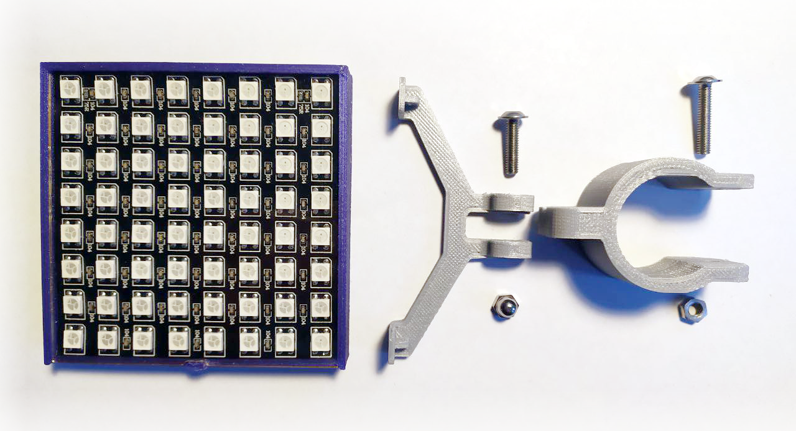
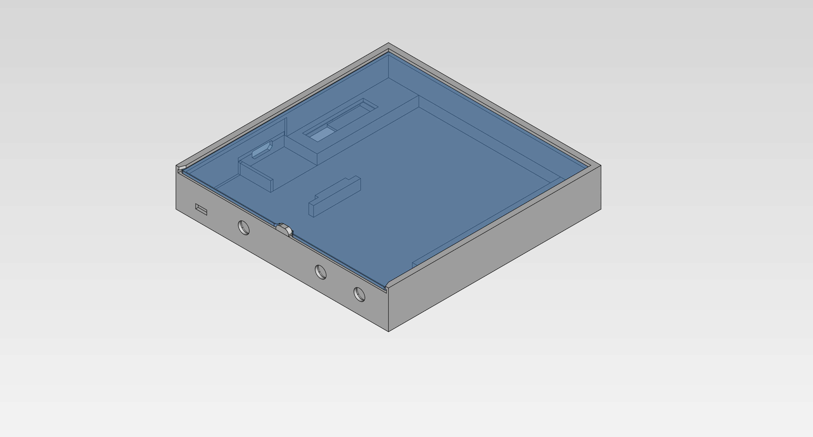
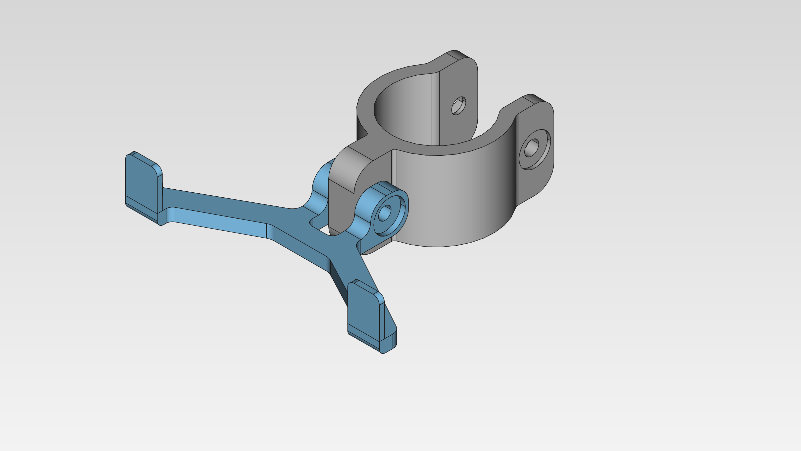
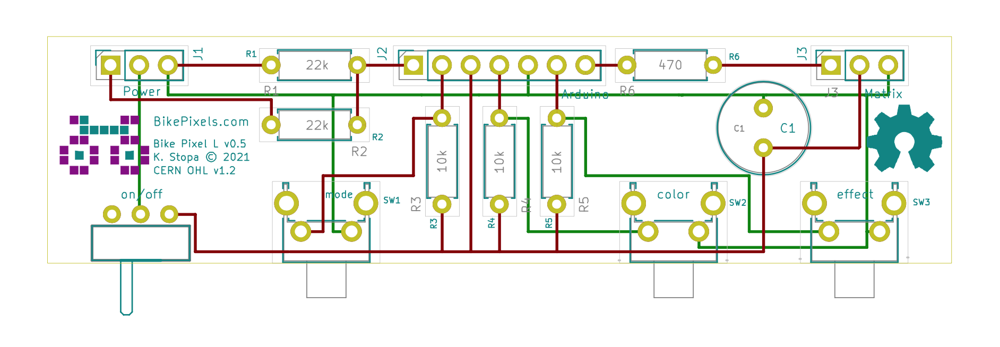
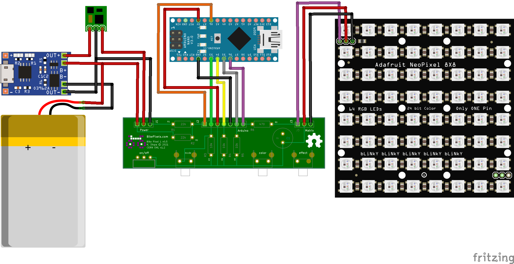

# Bike Pixels

Open Source Hardware project to build a set of highly customizable bycicle lights based on Arduino and Neo Pixel RGB matrixes. Currently all models can present different images in different colors with custom effects (blinking, bitting) and with adjustable brightness.

Check [Bike Pixel Official site](https://bikepixels.com) to the more details and recent news.

## Required software
All required applications to edit and design the different Bike Pixel models are open source. Bellow you can find all the tools that were used to design Bike Pixels:

* [Arduino IDE](https://www.arduino.cc/en/Main/Software): to write, biuld and upload the code to the Arduino board.
* [FreeCAD](https://www.freecadweb.org/wiki/Download): to design the cases.
* [KiCAD](http://kicad.org/download/): to design electronic schemas and the PCBs.
* [Fritzing](https://fritzing.org): only for circuit sketch documentation.

## Bike Pixel L (or rear)

This model it is intended to be installed in the back part of the bike like the saddle or over bike structure. Main properties and parts:

* Preset 10 diferent icons
* Adjustable color and brightness
* 64 LEDs NeoPixel matrix
* 84 x 84 x 14 mm (3.3 x 3.3 x 0.55 in)

### Components

To build your own Bike Pixel L you should have all the elements listed on this bill of materials:

* 1 x Arduino Pro Mini or Nano;
* 1 x NeoPixel 8x8 matrix (80x80x2mm);
* 3 x 10 kΩ resistence;
* 1 x 470 Ω resistence;
* 2 x 22 kΩ resistor;
* 1 x 1000 uf/6.3V capacitator (recommended but optional);
* 3 x vertical touch switches;
* 1 x on\off botton (optional if your battery holder have one built-in);
* 1 x TP4056 module;
* 1 x 5V Step-up module;
* 1 x >2000 mAh LiPo battery;
* 1 x M3 30mm bolt;
* 1 x M3 20mm bolt; 
* 2 x M3 nuts;
* connection PCB;
* wires and soldering stuff;
* 3D printed case;
* 3D printed holder.

More details on each part are commented on following points. Links to different proviedars and prices can be found on this blog entry.

### Case

The case is divided in multiple parts designed to be 3D printed. Current designs include body and holder models.

#### Main body

The body is composed the main body and a cover. You can print them using PLA altought for the cover a 1 mm thick piece of plexi is recommended.

You can get production files bellow.

| Part |                       Files                        |  
|------|----------------------------------------------------|
| Body | [sld](rear/case/body/case_bikepixels_rear.stl)     |
| Cover| [sld](rear/case/cover/case_bikepixels_rear_cover.stl), [svg](rear/case/cover/case_bikepixels_rear_cover.svg), [pdf](rear/case/cover/case_bikepixels_rear_cover.pdf) |

#### Bike attachment 

Current holder design is divided into two pieces. An attachment and a hook. To mount them on a bycicle you will need 2 x M3 nuts and 2 x M3 bolts of 30 and 20mm in lenght.

You can get production files bellow.

|  Part      |                           Files                             |
|------------|-------------------------------------------------------------|
| Hook       | [sld](rear/case/holder/holder_base_28mm-holder_hook.stl)    |
| Attachment | [sld](rear/case/holder/holder_base_28mm-holder_attach.stl)  |

### Electronics

#### Main components

To build your L model you will need all the electronic parts listed bellow along with some additional requirements.

|            Part              |              Comment                   |
|------------------------------|----------------------------------------|
| Arduino Nano or Pro Mini     | Clone or original                      |
| USB C TP4056 charging module | More information on [this blog entry](https://bikepixels.com/2019/11/10/how-to-add-a-lipo-battery-in-our-arduino-projects/)   |
| 5V Step-up module            | Any module designed for LiPo batteries |
| NeoPixel RGB matrix          | Flexible 80x80x2mm model               |
| >2000 LiPo battery           | Max. 4 mm thicknes                     |

#### Conexions PCB

The PCB encapsulates the switches and manage connections between the Arduino board, the step-up module and the RGB matrix. All the design have been created with KiCAD. All the source files including schematinc, netlist and PCB board are availble [here](./rear/electronics/bikepixel rear/).

Production files are available in different formats and are linked bellow:

|                         Format                            |
|-----------------------------------------------------------|
| [gerber](rear/electronics/production files/gerber/)       |
| [pdf](rear/electronics/production files/pdf/)             |
| [svg](rear/electronics/production files/svg/)             |
 

#### Assambley

To connect evrything together please follow schema bellow. After soldering everthing you can proceed to upload the code to Arduino.

## Code 

To compile the BikePixel [code for Arduino](./rear/src/bikepixel_sketch.ino), you'll need some extra libraries:

* [Adafruit GFX](https://github.com/adafruit/Adafruit-GFX-Library)
* [Adafruit NeoPixel](https://github.com/adafruit/Adafruit_NeoPixel)
* [Adafruit NeoMatrix](https://github.com/adafruit/Adafruit_NeoMatrix)

Note that you can install these libraries directly from Arduino Studio (Sketch menu, > Include Library > Manage Libraries) or by placing it after download into the Arduino Library folder (usally in your home).

## License

As the project is compond by software, hardware and documentation each of these parts are licensed under the terms of specific license.

### Software License

Copyright © 2021 by BikePixels.com and contributors:

* Krzysztof Stopa ([kstopa](https://github.com/kstopa/)).

Bike Pixels contains free software: you can redistribute it and/or modify it under the terms of the GNU General Public License as published by the Free Software Foundation, either version 3 of the License, or any later version.

Bike Pixels is distributed in the hope that it will be useful, but WITHOUT ANY WARRANTY; without even the implied warranty of MERCHANTABILITY or FITNESS FOR A PARTICULAR PURPOSE. See the GNU Lesser General Public License for more details.

You should have received a copy of the GNU Lesser General Public License along with CAMS tools. If not, see http://www.gnu.org/licenses/.

### Hardware License

Copyright © 2021 by BikePixels.com and contributors:

* Krzysztof Stopa ([kstopa](https://github.com/kstopa/)).

Hardware elements is licensed under the CERN OHL v. 1.2.

You may redistribute and modify this documentation under the terms of the CERN OHL v.1.2. (http://ohwr.org/cernohl). This documentation is distributed WITHOUT ANY EXPRESS OR IMPLIED WARRANTY, INCLUDING OF MERCHANTABILITY, SATISFACTORY QUALITY AND FITNESS FOR A PARTICULAR PURPOSE. Please see the CERN OHL v.1.2 for applicable conditions.

### Documentation and images License

Copyright © 2021 by BikePixels.com and contributors:

* Krzysztof Stopa ([kstopa](https://github.com/kstopa/)).

Documentation and image files are distributed under the Attribution-NonCommercial-ShareAlike 4.0 International (CC BY-NC-SA 4.0) lisence. The full text of the license can be found at the [CC BY-NC-SA 4.0 page](https://creativecommons.org/licenses/by-nc-sa/4.0/legalcode).