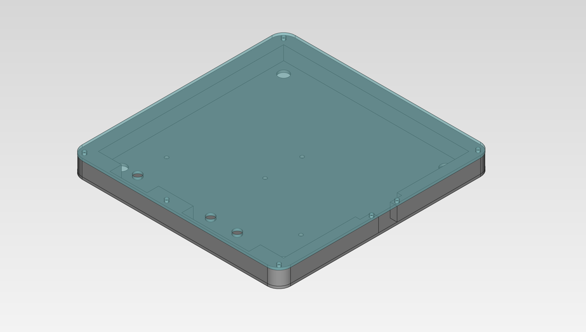

# BikePixels

Neo Pixel Matrix with Arduino for a rear and fron bicycle light with custom images and effects to ride safly by night.

As it name indicates the Rear version is intended to be installed in the back part of the bike. You can attach it to a backback, the seat or attached to the bike structure. 

## Bike Pixel Front

By now the front version is the more advanced as it includes built-in battery and 3D printed case so it is easier to ensamble. Appart from the design it also varies in functionallities as it only include mode and color button. So all the effects (blink, heart beat, etc) are integrated as modes. Also default colors are intended to be used for front lights (white, yellow, light blue, etc.) altough you can still set up to almost any color you want.

### Components

To build your own Front version of a Bike Pixel you will need all the components that are listed bellow:

* 1 x Arduino Pro Mini with USB;
* 1 x NeoPixel 8x8 matrix (flexible version recommended);
* 3 x touch switches;
* 1 x SMDF on off switch
* 2 x 10 kΩ resistence;
* 1 x 470 Ω resistence;
* 1 x button and connection PCB;
* 1 x TP5100 charging module;
* 1 x USB micro B module (to be integrated in the PCB in the future);
* 2 x LiPo batteries (max 30x30x6mm);
* 1 x 3D printed case (made of 3 elements);
* 1 x esparadrapo belt;
* wires and soldering stuff.

### Case

The case is designed to be 3D printed. All parts are designed using FreeCAD and STL production files are also included. It is composed by 3 pieces:

* main body of the case, that can be printed as you wish;
* a helper inner structure to hold the USB micro module and the TP5100 module;
* a top cover that should be printed using a transparend PLA or cut in 1mm plexi.

### PCB

The PCB encapsulates the buttons and manage connections between the the Arduino board and the different modules. Its desing is shown belllow:

### Code

Arduino code can be found at the front/src folder. To build it chech the build section.

### Assambly

The main schematic to connect all the elements it is shown bellow.

The first step is to get the button PCB and sold in all the buttons and the resistences. Then we can procede to start soldering all the connection between the fron the arduino board to the matrix and the TP5100 module.

## Bike Pixel Rear

### Components

To build your own Bike Pixel Rear you should have all the elements listed bellow:

* Arduino Nano (or any other Ardiuno or compatible board);
* 1 x NeoPixel 4x4 matrix (30x30x3mm);
* 3 x touch switches;
* 3 x 10 kΩ resistence;
* 1 x 470 Ω resistence;
* 1 x 1000 uf/6.3V capacitator (recommended but not used);
* 1 x 6 AAA battery holder (but you can try any other power source like a power bank);
* 1 x on\off botton (optional if your battery holder have one built-in);
* 9 x 1.6M screws with a length of 10 or 12 mm and nuts.
* 4 x 1.6M screws with a length of 4 mm and nuts.
* wires and soldering stuff;
* the case;
* 1 x 6 AAA battery holder (optional);
* 1 x on\off botton (optional if your battery holder have one built-in);
* 1 x Power bank 10000 mAh or more (optional).
    
For the power supply you can use a Powerbank connected directly to the Arduino Nano board or a battery holder, also you can try any other power sources. Then if you have all the components you can assemble it following the next schema.

### Sketches
At the docs folder you can find the sketches and the draws with schemas and case model so you can send this data to any manufacturer to cut and print it by you or just DIY.

#### Plexi Case

The case is designed to be made by joining three (or four optionally) layers of 
plexy. There are 2 possible configurations in both the base is made of 1 mm plexy 
black board and the top should be made of an 1 mm transparent plexy. The middle 
layers can be done with one 7-8 mm black board or two 5-6 mm + 2-3 mm boards. Bellow
you can find a case parts list: 

|      Piece      |            Thickness [mm]            |      Material     |                              CAD file                              |
|:---------------:|:------------------------------------:|:-----------------:|:------------------------------------------------------------------:|
|      Bottom     |                 1 or 2               |    Black plexi    | [case bottom.FCStd](docs/case/case%20bottom.FCStd)                   |
|      Middle     |  7 or 8   (5 or 6 if optional layer) |    Black plexi    | [case middle.FCStd](docs/case/case%20middle.FCStd)                   |
| Middle optional |                2 or 3                |    Black plexi    | [case middle optional.FCStd](docs/case/case%20middle%20optional.FCStd) |
|       Top       |                1 or 2                | Transparent plexi | [case top.FCStd](docs/case/case%20top.FCStd)                         |

To join the pices you'll need 1.6M screws and nuts with a length of 10 or 12 mm. 
All the CAD files has been created using FreeCAD and can be found at 
(docs/case)[docs/case] folder. Normally you will have to convert it to some other 
format (DXF, PDF, SVG) to send it to production. The final result should look similar to:

#### PCB
The PCB encapsulates the buttons and manage connections from Arduino to the neopixel 
matrix. It desing is shown belllow:

Production files are available in SVG and Gerber 

## Software
All required applications to edit and design BikePixel are open sourced. Bellow you can find all the used tools:

* [Arduino IDE](https://www.arduino.cc/en/Main/Software): to write, biuld and upload the code to the Arduino board.
* [Fritzing](http://fritzing.org/download/): to design electronic schemas and the PCB.
* [Inkscape](https://inkscape.org/en/release/): to design custom parts for Fritzing (e.g. the board).
* [FreeCAD](https://www.freecadweb.org/wiki/Download): to design the case.

## Setup
To compile the BikePixel [code for Arduino](./rear/src/bikepixel_sketch.ino), you'll need some extra libraries:

* [Adafruit GFX](https://github.com/adafruit/Adafruit-GFX-Library)
* [Adafruit NeoPixel](https://github.com/adafruit/Adafruit_NeoPixel)
* [Adafruit NeoMatrix](https://github.com/adafruit/Adafruit_NeoMatrix)

Note that you can install these libraries directly from Arduino Studio (Sketch menu, > Include Library > Manage Libraries) or by placing it after download into the Arduino Library folder (usally in your home).

## Assembling
Bellow you can find step by step asseble Bike Pixel using the designed case and PCB. By now Arduino and batteries are kept apart from the main box with buttons and the neopixel matrix. The idea is to attach Bike Pixel to a back back. 

### Case
The case is designed to be plugable to the back pack by using 4 spring snaps but you can use any other method like a good double-sided adhesive tape or a hook and loop fastener.

## Additional info
Bellow you can find additional documentation and interesting stuff related with NeoPixel that I've found interesting and usefull during the construction of Bike Pixel:

* [All you always wanted to know about NeoPixel](https://learn.adafruit.com/adafruit-neopixel-uberguide/the-magic-of-neopixels) including [NeoPixel best practices](https://learn.adafruit.com/adafruit-neopixel-uberguide/best-practices)
* [Snowflake Sweater with Bluetooth Control example and tutorial](https://learn.adafruit.com/neopixel-matrix-snowflake-sweater/overview)
* [Creation of a custom PCB on Fritzing](http://fritzing.org/pcb-custom-shape/). Note that if you use Incskape you should edit the SVG file (Saved as plain SVG) manually in any text editor and change the layer names (e.g `<g id="L4123">` to `<g id="silkscreen 1">`).

## License

As the project is compond by software, hardware and documentation each of these parts are licensed under the terms of specific license.

### Software License

Copyright © 2019 by BikePixels.com and contributors:

* Krzysztof Stopa ([kstopa](https://github.com/kstopa/)).

Bike Pixels contains free software: you can redistribute it and/or modify it under the terms of the GNU General Public License as published by the Free Software Foundation, either version 3 of the License, or any later version.

Bike Pixels is distributed in the hope that it will be useful, but WITHOUT ANY WARRANTY; without even the implied warranty of MERCHANTABILITY or FITNESS FOR A PARTICULAR PURPOSE. See the GNU Lesser General Public License for more details.

You should have received a copy of the GNU Lesser General Public License along with CAMS tools. If not, see http://www.gnu.org/licenses/.

### Hardware License

Copyright © 2019 by BikePixels.com and contributors:

* Krzysztof Stopa ([kstopa](https://github.com/kstopa/)).

Hardware elements is licensed under the CERN OHL v. 1.2.

You may redistribute and modify this documentation under the terms of the CERN OHL v.1.2. (http://ohwr.org/cernohl). This documentation is distributed WITHOUT ANY EXPRESS OR IMPLIED WARRANTY, INCLUDING OF MERCHANTABILITY, SATISFACTORY QUALITY AND FITNESS FOR A PARTICULAR PURPOSE. Please see the CERN OHL v.1.2 for applicable conditions.

### Documentation and images License

Copyright © 2019 by BikePixels.com and contributors:

* Krzysztof Stopa ([kstopa](https://github.com/kstopa/)).

Documentation and image files are distributed under the Attribution-NonCommercial-ShareAlike 4.0 International (CC BY-NC-SA 4.0) lisence. The full text of the license can be found at the [CC BY-NC-SA 4.0 page](https://creativecommons.org/licenses/by-nc-sa/4.0/legalcode).